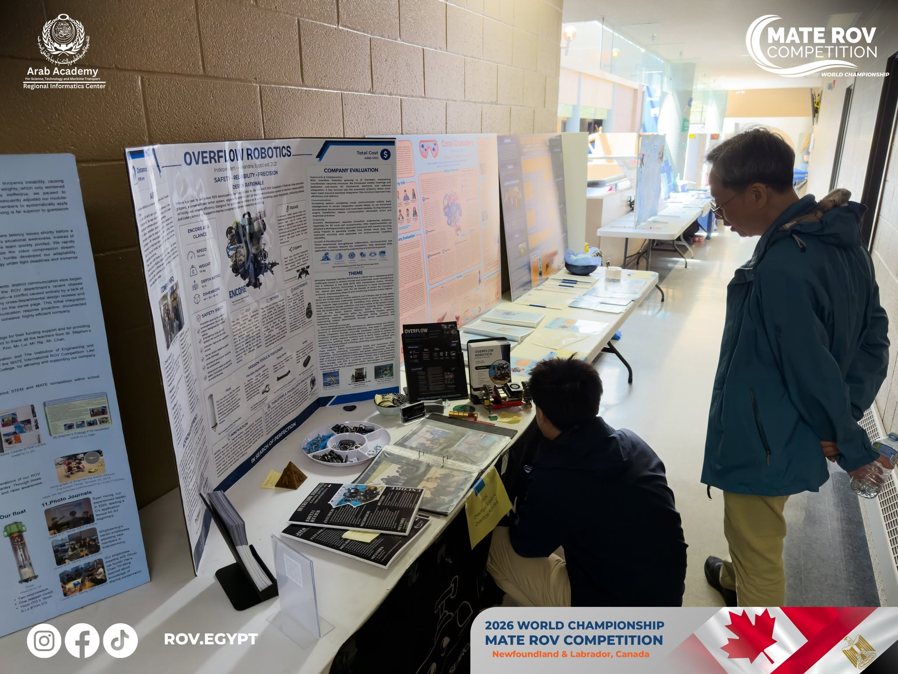

# Overflow Robotics — On-Site Marketing Site



A single-page companion site for Overflow Robotics' booth at the 2026 MATE ROV World Championship in Newfoundland & Labrador, Canada, accessible via QR code. It covers our mission, our ROV Encore, the build process, the team, and our community outreach.

## About Overflow Robotics

([Overflow Robotics](https://overflowrobotics.com/)) is an independent student engineering team based in Alexandria, Egypt, founded in 2021. The team competes in the [MATE ROV Competition's](https://materovcompetition.org/) Ranger class, designing and building ROVs for missions based on real-world engineering challenges. For the 2026 season, the team represented Egypt at the World Championship with its ROV, Encore.

## Running Locally

```bash
git clone https://github.com/nourawadallah/OverflowRoboticsOnSiteMarketing.git
cd OverflowRoboticsOnSiteMarketing
```

Open `index.html`, or skip this entirely and [view the live site](https://nourawadallah.github.io/OverflowRoboticsOnSiteMarketing/).
